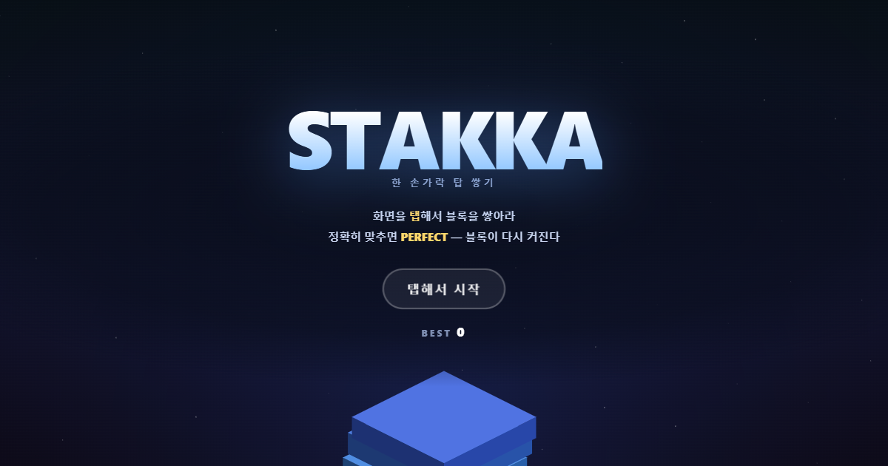
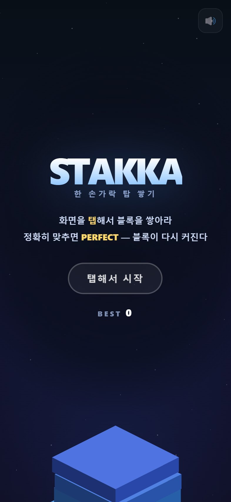
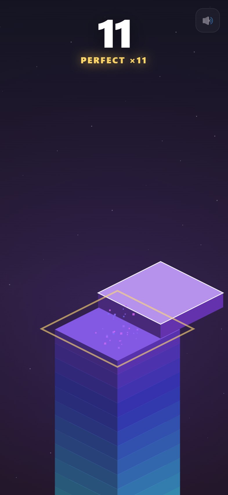
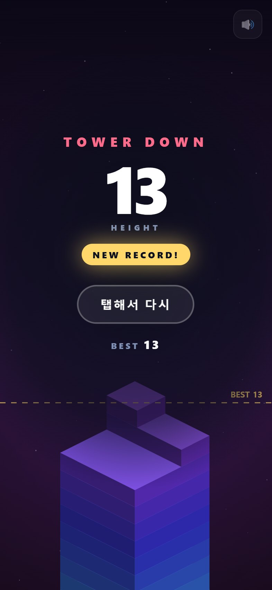

# STAKKA — 한 손가락 탑 쌓기

<p align="center">
  <a href="https://midasyoo.github.io/stakka/">
    
  </a>
</p>

<p align="center">
  <a href="https://midasyoo.github.io/stakka/"><b>▶︎ 지금 바로 플레이 — midasyoo.github.io/stakka</b></a>
</p>

<p align="center">
  
  
  
  
  
</p>

---

## 게임 소개

좌우로 왕복하는 블록을 **탭 한 번**으로 아래층에 맞춰 쌓아 올리는 아이소메트릭 타워 게임이다.
빗나간 만큼 블록이 **잘려나가고**, 더 이상 얹을 자리가 없으면 탑이 무너진다.

배울 것은 3초면 끝나지만, 놓기는 어렵다. 핵심 장치는 **PERFECT 회복**이다.

> 정확히 맞추면 안 잘릴 뿐 아니라, 콤보 2부터는 **잘려나갔던 블록이 다시 커진다.**
> 손톱만 해진 블록으로 버티다가 연속 PERFECT로 되살아나는 순간이 이 게임의 마약이다.

- 로그인·회원가입·설치 없음. 링크를 누르면 바로 시작
- 최고 기록은 기기에 저장되고, 플레이 중 **점선(BEST 라인)** 으로 화면에 계속 보인다
- 사운드는 오디오 파일 없이 실시간 합성 — 콤보가 오를 때마다 음이 반음씩 올라간다

---

## 바로 플레이하기

### 📱 휴대폰 (아이폰 / 안드로이드)

```
https://midasyoo.github.io/stakka/
```

카카오톡·문자로 링크를 받아 **탭하면 인앱 브라우저에서 바로 실행**된다.

### 🏠 앱처럼 쓰기 (홈 화면에 추가)

주소창 없는 전체화면으로 실행되고, 홈 화면에 전용 아이콘이 생긴다.

| 기기 | 방법 |
|---|---|
| **아이폰 (Safari)** | 하단 **공유 버튼(⬆︎)** → **홈 화면에 추가** → **추가** |
| **안드로이드 (Chrome)** | 우측 상단 **⋮** → **홈 화면에 추가** / **앱 설치** |

> 카톡 인앱 브라우저에서는 이 메뉴가 없다. 우측 하단 메뉴에서 **Safari로 열기 / 다른 브라우저로 열기**를 먼저 누르면 된다.

### 💻 PC

같은 주소를 브라우저에서 열면 된다. **마우스 클릭** 또는 **스페이스바**로 플레이.

---

## 게임 방법

> **화면은 기기에 맞춰 자동으로 바뀜다.**
> 스마트폰에서는 전체 화면 세로 레이아웃으로, PC 에서는 가운데 세로 스테이지로 놓이고
> 안내 문구도 '탭' → '클릭' 으로 바뀐다. 파일은 여전히 `index.html` 하나다.

### 조작

**단 하나뿐이다.**

| 기기 | 조작 |
|---|---|
| 휴대폰 / 태블릿 | 화면 아무 데나 **탭** |
| PC | **클릭** 또는 **스페이스바 / 엔터 / ↓** |

### 규칙

1. 블록이 좌우로 **왕복**한다. 아래층과 겹치는 순간 탭해서 내려놓는다.
2. 빗나간 만큼 블록이 **잘려나간다.** 잘린 조각은 아래로 떨어진다.
3. 다음 블록은 방금 놓은 블록의 크기를 물려받는다. → **빗나갈수록 다음이 어려워진다.**
4. 겹치는 부분이 사라지면 **TOWER DOWN.** 점수는 쌓아 올린 **층수**다.
5. 층이 올라갈수록 블록이 **빨라진다** (초당 108 → 최대 385).

### PERFECT & 콤보 — 이 게임의 핵심

거의 정확히 맞추면 **PERFECT**가 뜬다.

| 콤보 | 효과 |
|---|---|
| ×1 | 블록이 **전혀 안 잘린다** (크기 유지) |
| **×2 이상** | 크기 유지 + **블록이 다시 커진다** (원래 크기까지 회복) |
| ×3 이상 | 황금색 파동 · 강한 화면 흔들림 · 진동 |

즉 **연속 PERFECT는 유일한 회복 수단**이다. 실수로 얇아진 탑도 집중하면 되살릴 수 있다.

> ⚠️ **단, 허용 오차는 블록 크기에 비례한다.**
> 블록이 작아질수록 PERFECT 판정도 함께 좁아진다. 얇아진 상태에서의 회복은 진짜 실력이 필요하다.

### 알아두면 좋은 것

- **초반엔 즉사하지 않는다.** 왕복 폭이 기본 블록보다 좁아, 최대 크기 블록은 아무 때나 눌러도 최소한 걸친다. 위험은 블록이 작아진 다음부터 시작된다.
- **BEST 라인**을 넘어라. 자기 최고 기록이 화면에 점선으로 떠 있다.
- **게임 오버 후 0.5초 뒤 탭 한 번이면 즉시 재시작.** 메뉴로 돌아가지 않는다.
- 우측 상단 🔊 버튼으로 **음소거** 가능 (설정은 저장된다).

---

## 스크린샷

| 시작 화면 | 플레이 (PERFECT ×11) | 게임 오버 |
|:---:|:---:|:---:|
|  |  |  |

---

## 직접 실행하기

### 방법 1 — 다운로드해서 더블클릭 (가장 간단)

```bash
git clone https://github.com/midasyoo/stakka.git
```

`index.html`을 **더블클릭**하면 끝이다. 서버도, 빌드도, 설치도 필요 없다.
(`file://`로 열어도 게임·점수 저장 모두 정상 동작한다. 홈 화면 아이콘 기능만 서버 환경에서 동작한다.)

### 방법 2 — 로컬 서버로 띄우기

홈 화면 추가(PWA)까지 확인하고 싶을 때:

```bash
cd stakka
python -m http.server 8000
# → http://localhost:8000 접속
```

### 방법 3 — 내 GitHub Pages로 배포하기

이 저장소를 포크한 뒤 **Settings → Pages → Source: `main` / `/ (root)`** 로 지정하면
1~2분 뒤 `https://<내아이디>.github.io/stakka/` 에서 서비스된다. 빌드 과정이 없다.

> 배포 후 `index.html` 상단의 `og:image` / `og:url` 주소를 본인 주소로 바꾸면
> 카톡·페이스북 링크 미리보기 이미지가 정상 표시된다.

---

## 테스트

게임 로직 전체를 브라우저 없이 검증한다. (Node.js만 있으면 됨)

```bash
node test.js
# → 28 passed, 0 failed
```

`index.html`에서 `<script>`를 추출해 DOM을 흉내 낸 샌드박스에서 실행하므로,
**게임 코드에 테스트용 코드가 단 한 줄도 섞이지 않는다.**

검증 항목: 상태 전이 · 왕복 범위 · 슬라이싱 계산 · PERFECT 판정 · 콤보 회복과 상한 ·
게임 오버 조건 · 최고 기록 저장 · 재시작 쿨다운 · 300연속 배치 장기 안정성 · 렌더 무결성

실제로 이 테스트가 잡아낸 버그 두 개:

1. **무적 버그** — PERFECT 허용 오차가 고정값이라 블록이 그보다 작아지면 *모든* 배치가 자동 PERFECT로 판정 → 무한 회복 → 죽지 않는 게임이 됐다. 오차를 블록 크기 비례로 변경해 해결.
2. **첫 탭 즉사** — 왕복 폭이 블록보다 넓어 시작 0.4초 만에 손쓸 도리 없이 게임 오버가 가능했다. 왕복 폭을 줄여 "초반 안전 → 후반 치명적" 난이도 곡선으로 전환.

---

## 파일 구조

```
stakka/
├── index.html        게임 전체 (HTML + CSS + JS, 22KB) — 이거 하나면 실행된다
├── test.js           헤드리스 로직 테스트 28개
├── manifest.json     홈 화면 추가(PWA) 설정
├── icon-180.png      아이폰 홈 화면 아이콘
├── icon-192.png      안드로이드 / 파비콘
├── icon-512.png      스플래시 · 마스커블 아이콘
├── og.png            카톡·SNS 링크 미리보기 이미지 (1200×630)
└── screenshots/      README용 스크린샷
```

---

## 기술

| 항목 | 내용 |
|---|---|
| 구성 | **단일 HTML 파일**, 외부 라이브러리·프레임워크·빌드 도구 **전부 없음** |
| 렌더링 | Canvas 2D + 직접 구현한 2:1 아이소메트릭 투영 (윗면/좌측면/우측면 3면 셰이딩) |
| 사운드 | Web Audio API 실시간 합성 — **오디오 파일 0개** |
| 저장 | `localStorage` (최고 기록, 음소거 설정) |
| 입력 | Pointer Events (터치·마우스 통합) + 키보드 |
| 대응 | Retina/DPR 스케일링, 노치·홈바 안전영역, iOS 주소창 여닫힘, 더블탭 확대 차단 |
| 진동 | `navigator.vibrate` (지원 기기에서만) |

### 게임 밸런스 값

`index.html`의 `───── tuning ─────` 블록에서 전부 조절할 수 있다.

| 상수 | 값 | 의미 |
|---|---|---|
| `BASE` | 118 | 블록 한 변의 기본 크기 |
| `AMP` | 108 | 좌우 왕복 폭 — `BASE`보다 작아야 초반 즉사가 없다 |
| `PERFECT` | 4.4 | PERFECT 허용 오차 상한 (실제 판정은 `min(4.4, 크기×0.28)`) |
| `GROW` | 5.5 | 콤보 2 이상에서 한 번에 회복되는 크기 |
| `MIN_SIZE` | 2.2 | 이보다 얇게 겹치면 게임 오버 |
| `SPD0` / `SPD_K` / `SPD_MAX` | 108 / 4.3 / 385 | 시작 속도 / 층당 가속 / 최고 속도 |

---

<p align="center">
  <a href="https://midasyoo.github.io/stakka/"><b>몇 층까지 갈 수 있나? ▶︎ 플레이</b></a>
</p>
